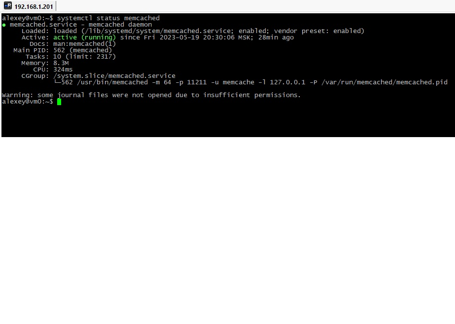
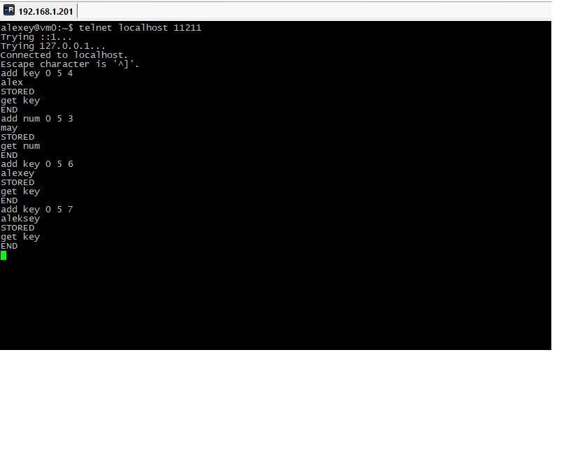
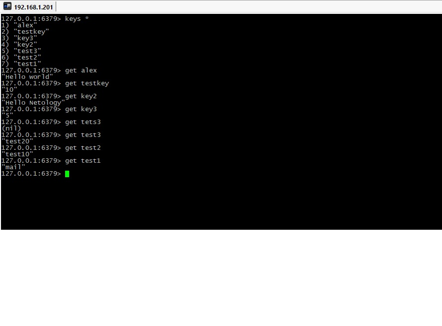
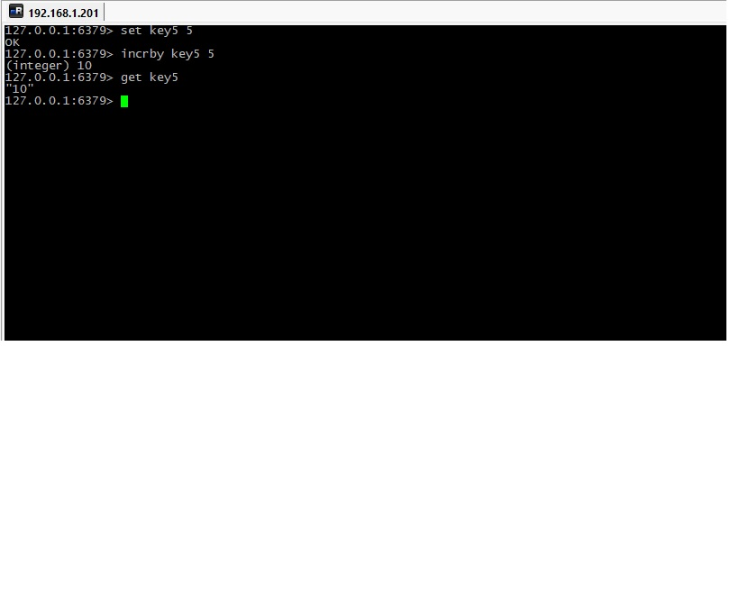

# Домашнее задание к занятию "`«Кеширование Redis/memcached»`" - `Дьяконов Алексей`

### Задание 1. Приведите примеры проблем, которые может решить кеширование.

1. `Увеличение скорости обработки - запросы из кэша обрабатывабтся быстрее `
2. `Повышение производительности - в кэш попадают часто запрашиваемые данные`
3. `Эконономия ресурсов - кэштруются тяжёлые запросы`
4. `Выравникание  резких скачков трафика`

### Задание 2. Установите и запустите memcached.

1. `Ставим пакеты`

```   
    sudo apt update && apt install memcached
    systemctl status memcached
```
2. `Если клиентом memcached будет не localhost, правим файл  /etc/memcached.conf`

-

### Задание 3. Запишите в memcached несколько ключей с любыми именами и значениями, для которых выставлен TTL 5.

1. `Подключаемся по telnet`

```
    telnet localhost 11211
```
2. `Добавляем ключ и значение`
```
    add key 0 5 7
    aleksey
```

-

### Задание 4. Запишите в Redis несколько ключей с любыми именами и значениями.

1. `Ставим пакеты`

```
    sudo apt update && apt install redis
    systemctl status redis
```

2. `Запускаем redis-cli`

```
    redis-cli
```

3. `Добавляем ключи`

```
     set key2 "Hello Netology"
     get key2
```  
-

### Задание 5. Запишите в Redis ключ key5 со значением типа "int" равным числу 5. Увеличьте его на 5, чтобы в итоге в значении лежало число 10.

-

